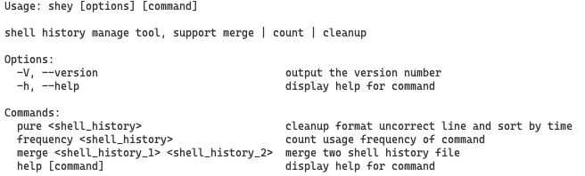

# Shey

Shey is a simple and easy-to-use CLI tool for managing your shell history. It offers these functions:

Currently supports ZSH history only, welcome PR to add more formats support

## Usage

1. npm -g install shey
2. shey

## TODO

- [ ]
